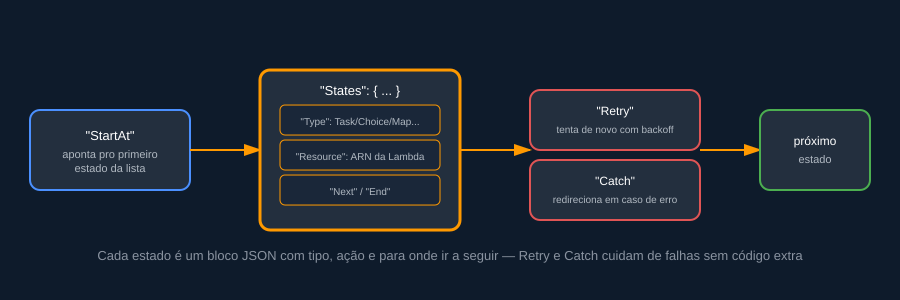
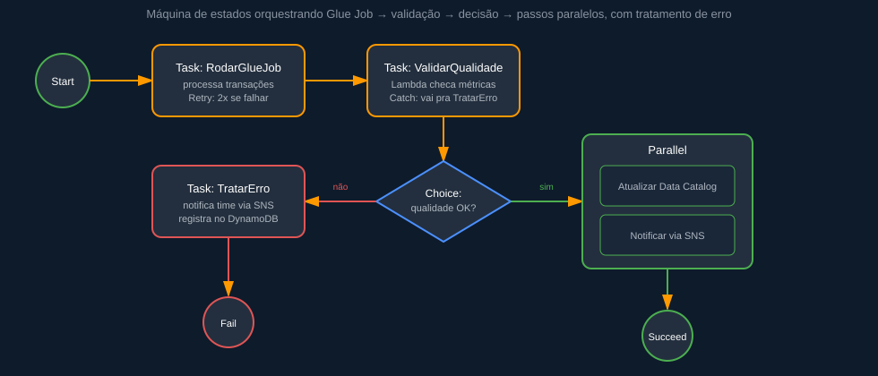

# Fundamentos de AWS Step Functions — anotações de estudo com exemplo prático

> Resumo de estudo sobre AWS Step Functions: como uma máquina de estados orquestra serviços serverless, como a Amazon States Language é estruturada e como tratar erros sem escrever cola de código — ilustrado com a orquestração de um pipeline de dados de cartão de crédito.

## O que é AWS Step Functions

Step Functions é o serviço de **orquestração serverless** da AWS: ele coordena a execução de outros serviços (Lambda, Glue, ECS, SNS, DynamoDB, entre dezenas de outros) como uma **máquina de estados**, definindo a ordem, as condições e o tratamento de erro de cada etapa — sem que você precise escrever o "cola" de código que hoje normalmente vive espalhado em Lambdas ou scripts de agendamento.

Em vez de uma Lambda chamar outra Lambda e torcer para que tudo dê certo, o fluxo inteiro vira uma definição declarativa, visível como um diagrama, com retry, timeout e tratamento de falha configurados por estado.

## Os dois tipos de workflow

| Tipo | Quando usar |
|---|---|
| **Standard** | Fluxos longos (até 1 ano), com histórico completo de execução, ideal para pipelines de dados e processos de negócio |
| **Express** | Fluxos de alto volume e curta duração (até 5 minutos), cobrados por número de execuções — ideal para processamento de eventos em tempo real |

## Anatomia de uma máquina de estados

Toda máquina de estados é descrita em **Amazon States Language (ASL)**, um JSON declarativo. A estrutura básica gira em torno de `StartAt`, a lista de `States`, e cada estado define seu `Type`, o que fazer (`Resource`, `Parameters`) e para onde ir depois (`Next` ou `End`).



Os tipos de estado mais usados:

- **Task** — executa um trabalho real: chama uma Lambda, um job do Glue, um container ECS.
- **Choice** — ramifica o fluxo com base em uma condição (`>`, `==`, existência de campo, etc).
- **Parallel** — executa múltiplos ramos ao mesmo tempo.
- **Map** — repete a mesma lógica para cada item de uma lista (ex.: processar N arquivos).
- **Wait** — pausa a execução por um tempo fixo ou até uma data.
- **Pass / Succeed / Fail** — estados de controle, sem lógica de negócio, usados para transformar dados ou encerrar o fluxo.

## Exemplo prático: orquestrando um pipeline de dados

Um cenário comum: todo dia, um job do Glue processa as transações de cartão do dia anterior; em seguida, uma Lambda valida a qualidade dos dados gerados; se estiver tudo certo, o catálogo é atualizado e o time é notificado em paralelo — se algo falhar, o erro é registrado e o time é avisado por outro caminho.



```json
{
  "Comment": "Pipeline diário de transações de cartão de crédito",
  "StartAt": "RodarGlueJob",
  "States": {
    "RodarGlueJob": {
      "Type": "Task",
      "Resource": "arn:aws:states:::glue:startJobRun.sync",
      "Parameters": {
        "JobName": "transformar-transacoes-cartao"
      },
      "Retry": [
        {
          "ErrorEquals": ["Glue.ConcurrentRunsExceededException"],
          "IntervalSeconds": 30,
          "MaxAttempts": 2,
          "BackoffRate": 2.0
        }
      ],
      "Next": "ValidarQualidade"
    },
    "ValidarQualidade": {
      "Type": "Task",
      "Resource": "arn:aws:states:::lambda:invoke",
      "Parameters": {
        "FunctionName": "validar-qualidade-transacoes"
      },
      "Catch": [
        {
          "ErrorEquals": ["States.ALL"],
          "Next": "TratarErro"
        }
      ],
      "Next": "QualidadeOk"
    },
    "QualidadeOk": {
      "Type": "Choice",
      "Choices": [
        {
          "Variable": "$.percentualErros",
          "NumericLessThan": 1,
          "Next": "PosProcessamento"
        }
      ],
      "Default": "TratarErro"
    },
    "PosProcessamento": {
      "Type": "Parallel",
      "Branches": [
        {
          "StartAt": "AtualizarCatalogo",
          "States": {
            "AtualizarCatalogo": {
              "Type": "Task",
              "Resource": "arn:aws:states:::glue:startCrawler.sync",
              "End": true
            }
          }
        },
        {
          "StartAt": "NotificarSucesso",
          "States": {
            "NotificarSucesso": {
              "Type": "Task",
              "Resource": "arn:aws:states:::sns:publish",
              "End": true
            }
          }
        }
      ],
      "Next": "Sucesso"
    },
    "TratarErro": {
      "Type": "Task",
      "Resource": "arn:aws:states:::sns:publish",
      "Next": "Falha"
    },
    "Sucesso": { "Type": "Succeed" },
    "Falha": { "Type": "Fail" }
  }
}
```

Repare que o tratamento de falha (`Retry`, `Catch`) faz parte da definição do fluxo, não de um `try/except` escondido dentro de uma função — isso deixa o comportamento de erro visível e auditável, sem precisar ler código para entender o que acontece quando algo dá errado.

## Integração direta com serviços AWS

Boa parte do valor do Step Functions vem das **integrações otimizadas** (`arn:aws:states:::servico:acao`), que dispensam uma Lambda intermediária só para chamar outro serviço. O padrão `.sync` (como em `glue:startJobRun.sync`) faz o Step Functions esperar o job terminar antes de avançar — sem polling manual.

## Quanto custa

Em workflows **Standard**, a cobrança é por transição de estado. Em **Express**, por número de execuções, duração e memória usada — modelo parecido com o do Lambda. Para pipelines de dados que rodam algumas vezes por dia, o Standard costuma ser suficiente e mais barato; para processar milhares de eventos por segundo, o Express se paga.

## Boas práticas

- Use `.sync` para tarefas que precisam terminar antes do próximo passo (evita orquestrar polling manualmente).
- Trate erros no nível do estado (`Retry`/`Catch`) em vez de dentro de cada Lambda — mantém a lógica de negócio limpa.
- Para pipelines de dados com múltiplos arquivos, o estado `Map` evita duplicar a mesma definição de Task várias vezes.
- Nomeie os estados de forma descritiva — o nome aparece no console visual, o que ajuda demais na hora de depurar uma execução.
- Habilite logging no CloudWatch para auditar o histórico completo de cada execução.

## Estrutura sugerida do repositório

```
projeto/
├── README.md
├── assets/
│   └── diagramas.svg
├── statemachine/
│   └── pipeline-transacoes.asl.json
├── lambdas/
│   └── validar_qualidade/
└── infra/
    └── template.yaml   # AWS SAM / CloudFormation / Terraform
```

## Referências

- [AWS Step Functions — documentação oficial](https://aws.amazon.com/step-functions/)
- [Amazon States Language — especificação](https://states-language.net/spec.html)

---

### 👨‍💻 Autoria e Notas Finais

* **Por:** Enner Sebastião Garcia
* **Nota:** Todas as imagens foram produzidas por IA.
